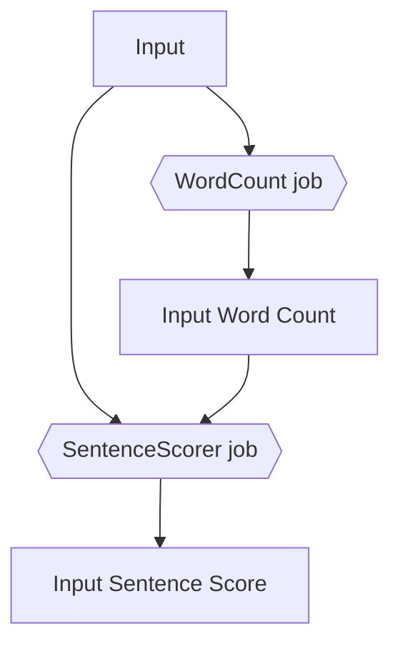
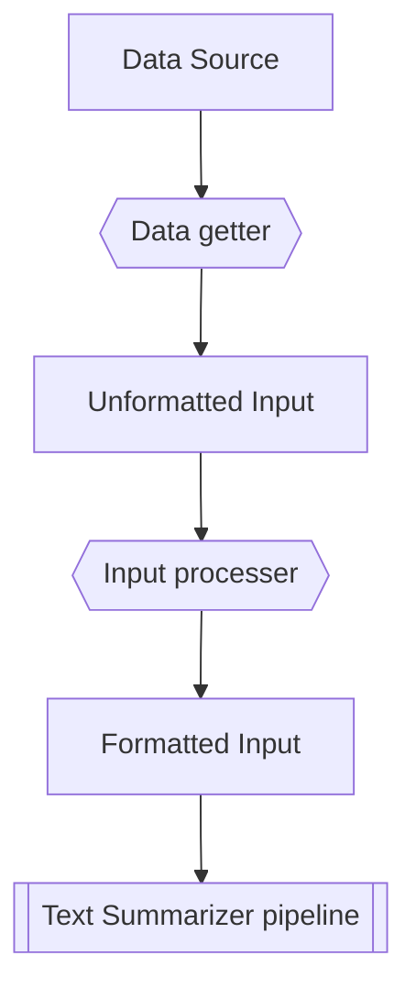

# Text summarizer

Essentially a mapreduce pipeline for finding the "summary" of any given piece of text file(s). We're working with two main assumptions here:
- Something should be in a summary if it shows up a lot
- We're just going to return the most relevent sentences to the summary as-is, no processing the sentences nor synthesizing info based on the text (outside of the scope for this application)

# General Info

So what does actually do?
- Two things:
- WordCount job
  - Creates a wordcount based on the input (Wordcount job) 
  - Output would be a .txt file with two columns, the word and its associated word count in all of the files
- SentenceScorer job
  - Scores each individual sentence based on the each word in the sentence
    - Example: given a word count with "apple 5", the score for the sentence "apple apple apple" would be 15 (apple=5, 5+5+5=15)
  - Then it would process all sentences on descending score, and return the specified number of sentences along with their scores (default = 10)
 
So basically the flow of data would be like this

**Text Summarizer pipeline data flow**

You can run WordCount and SentenceScorer individually - but normally one would run it sequentially in TextSummarizer.

# Running this pipeline

**Preconditions: You'll need hadoop, java**

Note: You can run either WordCount, SentenceScorer, or TextSummarizer in your IDE of choice and pass in the appropriate arguments, but we'll focus on running them in hadoop for now.

## Your input
Essentially can either be a single file, or a folder with multiple files. Each file is assumed to be a text file, and the following things must hold true for this pipeline to work:
- Each .txt file should have at least one row of words
- Each row should be one sentence. Sentence scoring is done at the sentence level so this is something we're assuming that is true for all rows.

**> But what if my data isn't a bunch of .txt files, where every row is one sentence?**
Then you need to process your data to conform with the requirements above. You would implement something like the chart below:

**How to pipe nonformatted data into the Text Summarizer pipeline**

Example, if your data was a news article, you would implement the following:
- Webpage scraper (your data getter)
   - Essentially you would get the text of what you need (this is a text summarizer)
- Input processor
   - Parse the unformatted text into the .txt files where each row is a sentence
 
Essentially, text is located anywhere, so your implementation of your data getter and input processor may vary on your needs. This repo doesn't contain any additional code other than the Text Summarizer.

## I've got my input, now what?

Note: Hadoop installation is not covered in this short guide.

To run on hadoop, you may want to spin up your namenode and datanodes
1. Go to your hadoop folder/sbin, and click on run-all.sh or the run-all bat file depending on your operating system.
2. Navigate over your command line and within it, navigate to the directory containing the TextSummarizer.jar file, and run the following command:

`hadoop jar TextSummarizer.jar /input /wordCountOutput /sentenceScoreOutput /locationOfWordCountFile [Num of sentences to display, default=10]`

Output will be located in a part-r-00000 file in the folder specified by /sentenceScoreOutput.

Similarly, to run the WordCount or the SentenceScorers individually, you can compile them into a jar file and then invoke them on hadoop, they'll tell you what arguments you'll need to pass in.
